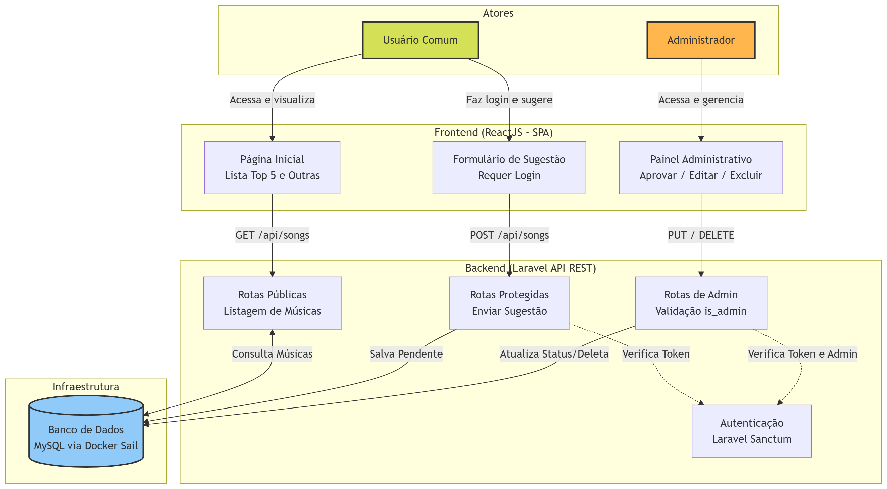

# 🎸 Top 5 Músicas - Tião Carreiro e Pardinho

Este projeto foi desenvolvido como um **sistema de ranking de músicas**, integrando **frontend em React (SPA)** com **backend em Laravel (PHP)**.  
O objetivo é exibir as músicas mais tocadas da dupla e permitir que os usuários façam sugestões de novos links do YouTube. A aplicação conta com um painel administrativo para **aprovação, edição e exclusão** das sugestões, tudo se comunicando via **API REST** e rodando em **Containers Docker**.

Inclui recursos de **autenticação**, **paginação**, **validação de rotas**, **design responsivo (TailwindCSS)** e **testes automatizados** no front e no back-end.

---

# 📊 Arquitetura e Fluxo da Aplicação

## Diagrama da Arquitetura



---

# ⚙️ Estrutura do Projeto

## 🖼 Interface (Frontend - React)

**App.jsx & Rotas**  
Implementa o roteamento da aplicação (Single Page Application) utilizando react-router-dom:

- Home: Exibe o Top 5 e a lista paginada das demais músicas.
- Auth: Tela de login/registro.
- Admin: Painel exclusivo para o administrador gerenciar as sugestões.

**Componentes (/src/components)**  
- SuggestionForm: Formulário protegido que envia o token Sanctum no cabeçalho.
- RankingList: Renderiza a listagem com o layout estilizado.

**Estilo (TailwindCSS)**  
Interface modernizada e responsiva configurada nos arquivos:
- tailwind.config.js
- index.css

---

## 🖥 Backend (API Laravel)

**SongController.php**
- index() → Retorna o Top 5 e as demais paginadas.
- store() → Recebe e valida novas sugestões (status pendente).
- updateStatus() & destroy() → Apenas administradores.

**Rotas e Segurança**
A API é dividida em:
- Rotas públicas
- Rotas protegidas com auth:sanctum
- Verificação de is_admin para operações críticas

---

# 🚀 Destaques e Aprendizados

- Ambiente Dockerizado com Laravel Sail
- Frontend SPA com React Router
- API REST com Laravel
- Testes Automatizados
- Arquitetura desacoplada (Front / Back)

---

# 🐳 Como Rodar o Projeto (Docker)

## Pré-requisitos
- Docker Desktop
- Node.js
- Composer (opcional)

---

## Backend (Laravel + Docker)

```bash
cd teste/back-end

# 1. Copie o arquivo de configuração
cp .env.example .env

# 2. Instale as dependências
docker run --rm \
    -u "$(id -u):$(id -g)" \
    -v "$(pwd):/var/www/html" \
    -w /var/www/html \
    laravelsail/php84-composer:latest \
    composer install --ignore-platform-reqs
```

### ⚠️ Importante
Antes de subir o Docker, abra o arquivo `.env` e configure:

```env
DB_CONNECTION=mysql
DB_HOST=mysql
APP_PORT=8000
```

Depois execute:

```bash
# 3. Suba os containers do Docker
./vendor/bin/sail up -d

# 4. Gere a chave da aplicação
./vendor/bin/sail artisan key:generate

# 5. Rode as migrations e seeders
./vendor/bin/sail artisan migrate --seed
```

API rodando em:
http://localhost:8000

---

## Frontend (React)

```bash
cd teste/front-end
npm install
npm run dev
```

Frontend rodando em:
http://localhost:5173

---

# 🧪 Testes Automatizados

## Backend
```bash
cd teste/back-end
./vendor/bin/sail artisan test
```

## Frontend
```bash
cd teste/front-end
npm run test
```

---

# 📂 Estrutura Completa

```
├── 📁 back-end (Laravel)
│   ├── 📁 app/Http/Controllers/Api
│   ├── 📁 database
│   ├── 📁 routes
│   ├── 📁 tests
│   ├── 📄 docker-compose.yml
│   └── 📄 .env
│
├── 📁 front-end (ReactJS)
│   ├── 📁 src
│   │   ├── 📁 components
│   │   ├── 📁 pages
│   │   ├── 📁 __tests__
│   │   ├── 📄 App.jsx
│   │   └── 📄 index.css
│   ├── 📄 package.json
│   └── 📄 vite.config.js
```

---

# 🧩 Tecnologias Utilizadas

## Frontend
- React
- Vite
- TailwindCSS
- React Router
- Vitest

## Backend
- Laravel
- Sanctum
- PHPUnit

## Infraestrutura
- Docker (Laravel Sail)
- MySQL

## Comunicação
- REST API

---

# 📌 Observações para o Avaliador

1. Certifique-se de configurar o arquivo `.env` antes de subir os containers.
2. O backend roda na porta **8000**.
3. O frontend roda na porta **5173**.
4. O banco é criado automaticamente pelas migrations e seeders.
5. O projeto já possui testes automatizados no frontend e backend.
6. **Credenciais de Teste (Geradas pelo Seeder):**
   - **Administrador:** Email: `admin@supliu.com.br` | Senha: `senha123`

